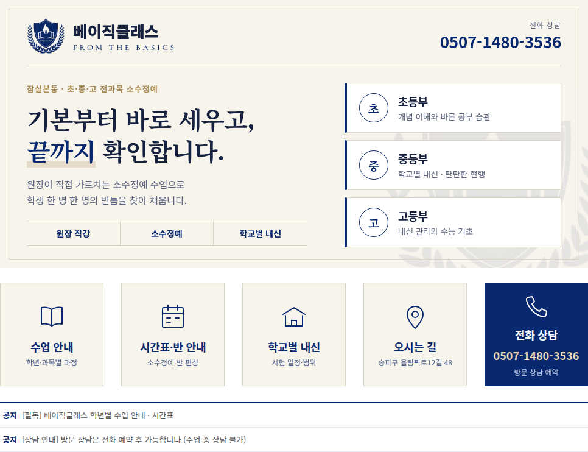

# 베이직클래스 네이버 블로그 전면 개편안

- 대상: https://blog.naver.com/basic9265
- 학원: 베이직클래스 (서울 송파구 잠실본동, 올림픽로12길 48 301호) · 초·중·고 전과목 · 소수정예
- 개편 목적: **① 지역 검색 노출 증가 ② 신규 상담 전환 증가**
- 결과물: `images/` (적용용 PNG), `src/design.html` + `src/logo.jpg` (이미지 원본 — 문구 수정 후 재출력 가능)
- 디자인 방향: 로고 기반, 신뢰감 있는 차분한 톤 (v2)

---

## 0. 결론 요약

1. **첫 화면은 "학년 → 상담"으로 이어지는 구조로 단순화합니다.** 지금의 대각선 사진 콜라주는 걷어내고, 한 문장(원장 직강·끝까지 확인)과 학년 카드 3개, 버튼 5개만 남깁니다.
2. **지역 검색 노출은 블로그만으로는 한계가 있습니다.** "잠실 수학학원"류 검색에서는 **네이버 플레이스(스마트플레이스)**가 블로그보다 위에 노출됩니다. 블로그 개편과 플레이스 정비를 한 묶음으로 진행해야 효과가 납니다.
3. **학부모 방문은 대부분 모바일입니다.** PC 타이틀·위젯은 모바일에서 보이지 않거나 다르게 보이므로, **모바일 커버·대표 글·글 하단 상담 문구**를 따로 설계합니다(4장).
4. **법규상 즉시 수정할 항목이 있습니다.** 현재 배너의 "구멍 없는 **선행**" 문구가 해당합니다(6장).

---

## 1. 현재 블로그 진단 (2026-09 캡처 기준)

| # | 문제 | 영향 | 조치 |
|---|---|---|---|
| 1 | 화면 오른쪽 끝에 **지도·연락처 박스가 한 번 더 반복**되어 보임 | 넓은 모니터에서 깨져 보여 전문성이 떨어짐 | 타이틀·스킨 배경을 "반복 없음 + 단색 배경"으로 변경 (3장) |
| 2 | 배너 오타 **"Basics calss"** | 학원 신뢰도에 직접 타격 | 새 배너로 교체 |
| 3 | "구멍 없는 **선행**" 문구 | 선행교육규제법상 선행학습 유발 광고 금지 조항과 충돌 가능 | "탄탄한 현행"으로 대체 (6장) |
| 4 | 스톡 모델 사진 | 학원 실체가 드러나지 않아 차별성이 없음 | 실제 교실·원장 사진으로 교체 권장(초상권 동의 필수) |
| 5 | 공지 제목의 **키워드 나열** ("잠실 초등 수학 학원, 잠실 중등 수학 학원, 잠실 고등 수학 학원") | 검색 품질 평가에서 불리할 수 있고, 사람이 읽기에도 어색함 | 제목은 "지역+학년+과목" 1회 + 구체적 주제로 작성 (5장) |
| 6 | 최신 공지가 2024년 | 운영하지 않는 학원처럼 보임 | 고정 글 교체 + 주 2회 연재 |
| 7 | 버튼 5개 중 "베이직 클래스를 만나면 성적이 달라집니다"는 기능이 없는 문구 | 클릭해도 목적지가 불분명함 | "시간표·반 안내" 버튼으로 교체 |

---

## 2. 새 첫 화면 구성



| 영역 | 파일 | 크기 | 역할 |
|---|---|---|---|
| 타이틀 이미지 | `images/title_966x440.png` | 966×440 | 브랜드·핵심 메시지·학년 안내·전화번호 |
| 위젯 ① 수업 안내 | `images/btn1_170x170.png` | 170×170 | → 학년별 수업 안내 고정 글 |
| 위젯 ② 시간표·반 안내 | `images/btn2_170x170.png` | 170×170 | → 시간표·반 편성 안내 글 (교습비 제외, 6장 참조) |
| 위젯 ③ 학교별 내신 | `images/btn3_170x170.png` | 170×170 | → "잠실 학교별 내신 정보" 카테고리 (5장, 검색 유입의 핵심) |
| 위젯 ④ 오시는 길 | `images/btn4_170x170.png` | 170×170 | → 네이버 지도(플레이스) 링크 |
| 위젯 ⑤ **전화 상담 (주 버튼)** | `images/btn5_170x170.png` | 170×170 | → **네이버 플레이스 URL** (모바일에서는 플레이스의 "전화" 버튼으로 스마트콜 연결, 4.1 참조) |
| 모바일 커버 | `images/mobile_cover_1080.png` | 1080×1080 | 블로그 앱 홈 커버 (4장) |

**메시지 설계 원칙**
- 헤드라인은 하나만 둡니다: "기본부터 바로 세우고, **끝까지** 확인합니다." 로고 슬로건 FROM THE BASICS를 한국어로 풀고, 원장 직강·소수정예의 강점(끝까지 확인)을 이었습니다.
- 톤: 로고 방패의 남색(`#082970`)을 주색으로, 아이보리 바탕과 명조 제목으로 차분하고 신뢰감 있게 구성했습니다. 강조색은 채도가 낮은 금색 한 가지만 씁니다.
- **상담 창구는 전화 하나로 통일했습니다.** 카카오톡 상담은 운영하지 않으므로 버튼 5개 중 전화 상담만 남색으로 채워 가장 눈에 띄게 했습니다. 나머지 4개는 아이보리입니다. 전화번호는 타이틀 오른쪽 위, 전화 버튼, 모바일 커버, 모든 글 하단의 네 곳에 반복해 넣었습니다.
- 성적 향상 수치나 합격 실적처럼 **검증 자료가 없는 주장은 넣지 않았습니다.** 넣으려면 기간·표본·산출 기준을 함께 표시해야 합니다(6장).
- 학년 카드의 문구(예: "개념 이해와 바른 공부 습관")는 초안입니다. 실제 커리큘럼에 맞게 `src/design.html`에서 고친 뒤 다시 출력하면 됩니다.

---

## 3. 네이버 블로그 적용 방법 (PC)

> 메뉴 이름은 네이버 개편에 따라 조금씩 바뀝니다. 아래는 **내 메뉴 → 관리 → 꾸미기 설정 → 레이아웃·위젯 설정 / 세부 디자인 설정(리모콘)** 기준입니다.

1. **레이아웃**: 1단(글 영역 전체 폭) 또는 기존 레이아웃을 유지합니다. 타이틀 아래에 위젯을 가로로 배치할 수 있는 형태를 고릅니다.
2. **타이틀**(리모콘 → 타이틀)
   - 블로그 제목 표시: **끔** (이미지에 이미 로고가 있음)
   - 디자인: 직접 등록 → `title_966x440.png` 업로드, 영역 높이 440px
   - 배경: 이미지 **반복 없음**, 배경색 `#F7F4EC`(아이보리)로 지정 → 넓은 화면에서도 타이틀 띠가 자연스럽게 이어짐 (**1장 #1 해결**)
3. **스킨 배경**(리모콘 → 스킨 배경): 기존 배경 이미지 삭제 → 단색 `#FFFFFF`
4. **위젯 5개 등록**(레이아웃·위젯 설정 → 위젯 직접등록)
   - 버튼 PNG 5개를 **비공개 글 하나에 업로드**하고, 각 이미지의 주소를 복사합니다.
   - 위젯마다 아래 코드를 넣고 순서대로 배치합니다.
   ```html
   <a href="연결할_주소" target="_blank"></a>
   ```
   - 연결할 주소: 고정 글 URL, 카테고리 URL, 네이버 지도 URL(`naver.me/...`)
5. **프롤로그**: 대표 메뉴를 "프롤로그"로 두고, 글 목록형 + 상단 고정 글 3개(4장)로 설정합니다.
6. 적용 후 **1920px 이상 모니터와 노트북(1366px)** 두 환경에서 반복·어긋남이 없는지 확인합니다.

---

## 4. 모바일 대응 (상담 전환의 핵심)

모바일 블로그 앱과 모바일 웹에는 PC 타이틀과 위젯이 나오지 않습니다. 모바일 방문자에게는 아래 세 가지가 첫인상입니다.

1. **모바일 커버 이미지**(블로그 앱 → 내 블로그 → 홈 편집): `images/mobile_cover_1080.png`(1080×1080)을 사용합니다. 로고·슬로건·헤드라인·전화번호만 넣었습니다.
2. **대표 글(공지) 3개 고정**
   - [필독] 베이직클래스 학년별 수업 안내 (초등부·중등부·고등부)
   - [시간표·반 안내] 2026년 ○학기 학년별 시간표와 소수정예 반 편성
   - [상담 예약] 방문 상담 예약 방법 · 오시는 길
3. **모든 글 하단에 들어갈 상담 문구**(글감 → 템플릿으로 저장)

   > **베이직클래스 · 잠실본동 초·중·고 전과목 소수정예**
   > 📞 **상담 전화 0507-1480-3536** (모바일에서 번호를 누르면 바로 연결됩니다)
   > 📍 서울 송파구 올림픽로12길 48, 301호
   > ※ 수업 중에는 방문 상담이 어렵습니다. 전화로 예약 후 방문해 주세요. 교습비와 반 편성은 상담 시 자세히 안내드립니다.

   이 블록 아래에 **네이버 지도(장소) 첨부**를 반드시 넣습니다. 글과 플레이스가 연결되어 지역 검색에 도움이 됩니다.

### 4.1 상담 전화와 일반 전화 구분 (네이버 스마트콜)

**원칙: 블로그·플레이스·모든 홍보물에는 스마트콜 번호 `0507-1480-3536` 하나만 공개하고, 일반전화 `02-3431-3536`은 공개하지 않습니다.**

```
학부모 ─(블로그·플레이스에서 0507-1480-3536)─▶ 네이버 스마트콜 ─▶ 02-3431-3536 ─(착신전환)─▶ 어머님 휴대폰
                                                   └ 연결 전 "네이버를 통한 전화" 안내 멘트
기존 거래처·재원생 ─(02-3431-3536 직접)──────────────────────────▶ 어머님 휴대폰 (멘트 없음)
```

전화를 받기 전에 안내 멘트가 들리면 신규 상담 전화이고, 멘트 없이 연결되면 일반 전화입니다.

**설정·점검 순서**
1. **스마트플레이스 → 업체정보 → 전화번호**에서 대표번호가 `02-3431-3536`이고, 스마트콜 사용이 켜져 있으며, 노출 번호가 `0507-1480-3536`인지 확인합니다. 끝자리가 같아서 이렇게 연결되어 있을 가능성이 높지만 반드시 화면에서 확인하십시오.
2. **스마트콜 설정에서 수신 안내 멘트(통화 연결 전 알림)를 켭니다.** 멘트 이름, 녹음 가능 여부, 발신번호 표시 방식은 스마트플레이스 개편에 따라 바뀔 수 있습니다. 설정 화면이나 스마트플레이스 고객센터에서 확인하십시오.
3. **착신전환 상태에서 멘트가 실제로 들리는지 시험 통화를 합니다.** 다른 휴대폰으로 0507 번호에 걸어 어머님 휴대폰에서 멘트가 나오는지 봅니다. 착신전환을 거치면 통신사 설정에 따라 멘트나 발신번호 표시가 달라질 수 있습니다.
4. **기존 블로그 글·플레이스 소개글·전단·현수막에서 `02-3431-3536`을 찾아 `0507-1480-3536`으로 바꿉니다.** 블로그는 내 블로그 검색창에 "3431"을 입력하면 해당 글을 찾을 수 있습니다. 한 곳이라도 02 번호가 남아 있으면 그 경로로 들어온 상담 전화는 구분되지 않습니다.
5. 블로그의 "전화 상담" 버튼은 `tel:` 대신 **네이버 플레이스 주소**로 연결합니다. 모바일 학부모는 플레이스의 "전화" 버튼을 거쳐 스마트콜로 걸게 되고, PC 방문자는 화면의 번호를 보고 겁니다. 어느 경로든 0507 번호이므로 구분이 유지됩니다.

**부수 효과**: 스마트콜로 들어온 통화는 스마트플레이스 통계에 집계되므로, 개편 전후의 **신규 상담 전화 수**를 비교할 수 있습니다(7장 성과 지표).

**한계**: 블로그를 보고 건 전화인지 플레이스를 보고 건 전화인지는 같은 번호라서 구분되지 않습니다. 필요하면 상담 때 "어떻게 알고 연락 주셨어요?"를 한 줄 기록하는 것이 가장 확실합니다.

---

## 5. 카테고리·콘텐츠 재구성 (지역 검색 노출)

### 5.1 카테고리

```
📌 학원 안내
   ├ 베이직클래스 소개 · 원장 소개
   ├ 시간표 · 반 안내
   └ 오시는 길 · 상담 예약
📘 초등부      ├ 수학 ├ 영어 └ 국어·독서
📗 중등부      ├ 수학 ├ 영어 ├ 국어 └ 사회·과학
📕 고등부      ├ 수학 ├ 영어 ├ 국어 └ 탐구
🏫 잠실 학교별 내신 정보   ← 지역 검색 노출의 핵심
   └ (재원생이 다니는 학교 기준) 시험 일정·범위·대비 후기
✏️ 수업 이야기   ├ 수업 현장 └ 학부모·학생 후기(동의 받은 글만)
📢 공지사항
```

- 카테고리는 학부모가 판단하는 순서(학년 → 과목)로 짰습니다. 지금처럼 과목부터 나누면 초등 학부모가 중·고등 글 사이에서 헤매게 됩니다.
- **"잠실 학교별 내신 정보"**를 두는 이유: 학부모는 "잠신중 2학년 기말 수학 범위"처럼 학교 이름으로 검색합니다. 경쟁 글이 적고 검색 의도가 분명해서 상담으로 이어질 확률이 높습니다. 학교 목록은 **실제 재원생 학교**로 확정합니다.

### 5.2 제목 규칙

| 나쁜 예 | 좋은 예 |
|---|---|
| 잠실 초등 수학 학원, 잠실 중등 수학 학원, 잠실 고등 수학 학원 | 잠실 중등 수학 학원 베이직클래스, 중2 2학기 일차함수를 이렇게 가르칩니다 |
| 수업 안내 | 잠실본동 초등 영어, 소수정예 반 수업은 이렇게 진행됩니다 |

- 지역+학년+과목 키워드는 **제목 앞부분에 한 번만** 넣습니다.
- 본문 첫 문단에 학원명과 지역(잠실본동·송파)을 자연스럽게 한 번 언급합니다.
- 직접 찍은 사진을 3장 이상 넣습니다. 스톡 이미지만 쓴 글은 신뢰도가 낮습니다.

### 5.3 연재 캘린더 (주 2회 권장)

| 주차 | 화요일 (정보성) | 금요일 (학원 실체) |
|---|---|---|
| 1 | 학교별 시험 일정·범위 | 이번 주 수업 현장 |
| 2 | 학년별 과목 학습법 (예: 중1 수학 첫 시험 준비) | 소수정예 반 운영 방식 |
| 3 | 교육 제도 해설 (예: 고교학점제, 내신 5등급제) | 학생 질문 모음·오답 사례 |
| 4 | 방학·학기 특강 안내 | 학부모 후기 (동의 받은 글) |

> 시험 기간 4주 전부터는 "학교별 내신 정보" 비중을 높입니다. 검색량이 가장 많은 시기입니다.

### 5.4 네이버 플레이스(스마트플레이스) 함께 정비

- 업체명, 주소(301호까지), 전화, 영업시간, 대표 사진(실제 교실)을 최신으로 맞춥니다.
- 플레이스의 **블로그 연결** 항목에 basic9265를 연결합니다.
- 플레이스 소식에 블로그 신규 글을 주 1회 공유합니다.
- 방문 상담을 한 학부모에게 **영수증·방문자 리뷰**를 요청합니다. 대가를 주고 받는 리뷰는 금지입니다(6장).

---

## 6. 법규·표현 점검

| 항목 | 근거 | 조치 |
|---|---|---|
| **선행학습 유발 광고 금지** | 「공교육 정상화 촉진 및 선행교육 규제에 관한 특별법」 제8조(학원 등의 선행학습 유발 광고·선전 금지) | "선행", "○년 앞서" 같은 표현을 배너·제목·해시태그에서 삭제합니다. 대체 표현: "탄탄한 현행", "학교 진도에 맞춘 완전 학습" |
| **교습비 게시·표시** | 「학원의 설립·운영 및 과외교습에 관한 법률」 제15조(교습비등) 및 시행령 | 블로그에는 교습비를 싣지 않는 것을 기본으로 합니다. 다만 블로그가 **학원 광고로 보아 교습비 표시 의무가 적용되는지** 강동송파교육지원청 평생교육 담당에 먼저 확인합니다 (6.1) |
| 성적·합격 실적 표현 | 「표시·광고의 공정화에 관한 법률」 (거짓·과장 광고 금지) | "성적이 달라집니다" 같은 결과 보장 문구는 쓰지 않습니다. 실적을 올린다면 기간·인원·기준을 명시합니다 |
| 후기·리뷰 | 공정위 「추천·보증 등에 관한 표시·광고 심사지침」 | 대가를 준 후기는 "소정의 대가를 받음"을 표시합니다. 가능하면 대가 없는 후기만 씁니다 |
| 학생 사진·성적표 | 「개인정보 보호법」, 초상권 | 보호자의 서면 동의를 받습니다. 얼굴·이름·학교를 가립니다 |

> 조문 번호와 세부 의무는 개정될 수 있으므로, 게시 전에 법제처 국가법령정보센터(law.go.kr) 최신본으로 확인하십시오.

### 6.1 교습비 비공개에 대한 판단

- **블로그에 교습비를 싣지 않는 것 자체는 가능합니다.** 다만 두 가지를 확인하셔야 합니다.
  1. **법적 표시 의무**: 학원법은 교습비를 학원 안에 게시하도록 하고, 광고할 때 교습비 등을 표시하도록 정하고 있습니다. 블로그 글이 여기서 말하는 "광고"에 해당하는지, 해당한다면 어떤 형식으로 표시해야 하는지는 **관할 교육지원청의 해석을 받는 것이 가장 확실합니다.** 문의 결과에 따라 아래 중 하나를 택합니다.
     - 표시 의무가 없다고 안내받으면: 블로그에는 싣지 않고 "교습비는 전화 상담 시 안내" 문구만 둡니다.
     - 표시 의무가 있다고 안내받으면: 배너·버튼이 아니라 **공지 글 하나에만** 요구되는 최소 형식으로 게시하고, 다른 글에는 반복하지 않습니다.
  2. **경쟁 학원 차단 효과는 제한적입니다.** 학원이 교육청에 등록한 교습비는 교육청 공개 조회 서비스(나이스 대국민서비스의 학원·교습소 정보 등)에서 누구나 조회할 수 있는 것으로 알고 있습니다. 조회 가능 여부를 먼저 확인해 보시기 바랍니다. 블로그에 싣지 않아도 경쟁 학원은 알 수 있으므로, 비공개의 실익은 **"학부모가 가격만 보고 상담 없이 이탈하는 것을 막는다"**는 쪽에 있습니다. 전화 상담 유도 전략과는 잘 맞습니다.

---

## 7. 실행 체크리스트

- [ ] 오타·"선행" 문구가 있는 기존 배너 즉시 교체 (1일)
- [ ] 강동송파교육지원청에 블로그 교습비 표시 의무 문의 (1주)
- [ ] 스마트콜 수신 안내 멘트 켜기 + 착신전환 시험 통화 + 기존 글의 02 번호 교체 (1일, 4.1)
- [ ] 타이틀·위젯·스킨 배경 적용, 반복 버그 확인 (1일)
- [ ] 고정 글 3개 작성: 수업 안내 / 시간표·반 안내 / 전화 상담 예약 (1주)
- [ ] 카테고리 재편: 기존 글은 새 카테고리로 이동하고, 삭제하지 않음 (1주)
- [ ] 글 하단 상담 템플릿 저장, 모바일 커버 설정 (1주)
- [ ] 스마트플레이스 정보 갱신·블로그 연결 (1주)
- [ ] 실제 교실·원장 사진 촬영 → 배너 v2에 반영 (2~4주)
- [ ] 주 2회 연재 시작, 8주 후 성과 점검

### 성과 지표 (개편 전후 비교)

| 지표 | 확인 위치 |
|---|---|
| 검색 유입 수·유입 검색어 | 블로그 통계 → 유입 분석 |
| 플레이스 전화·길찾기 클릭 | 스마트플레이스 통계 |
| 신규 상담 전화 수 (스마트콜 통화) | 스마트플레이스 통계 → 스마트콜 |
| **월 신규 상담 건수와 등록 전환율** | 원내 상담 기록 (유입 경로를 반드시 물어서 기록) |

> 검색 유입과 상담 건수는 계절성이 큽니다(시험 기간, 방학 전). **전년 같은 달 대비**로 비교해야 개편 효과를 과대평가하지 않습니다.
